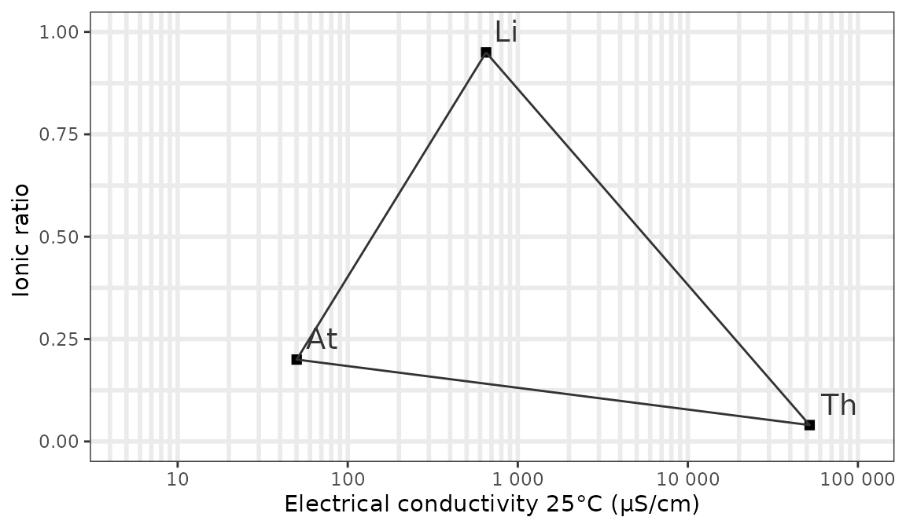
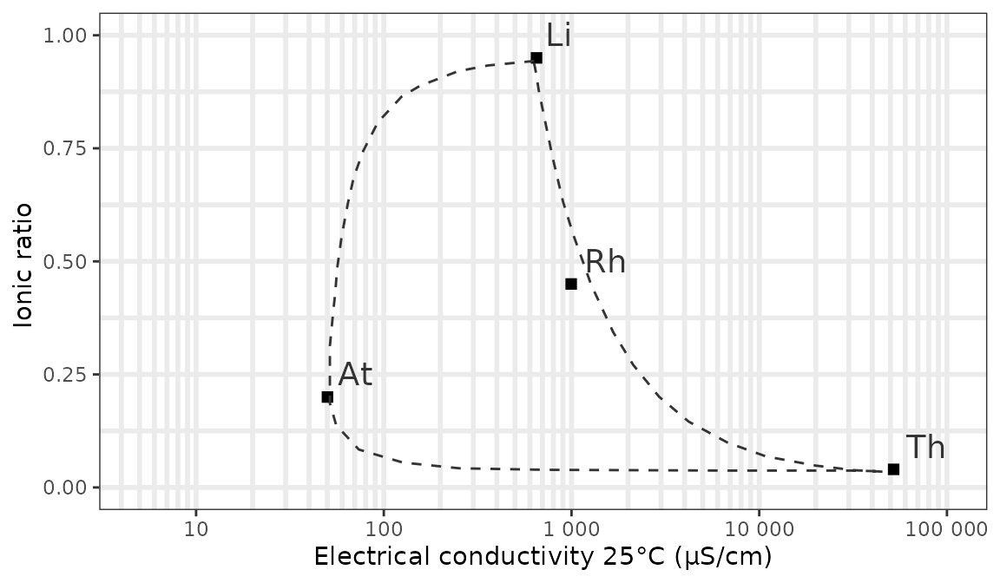
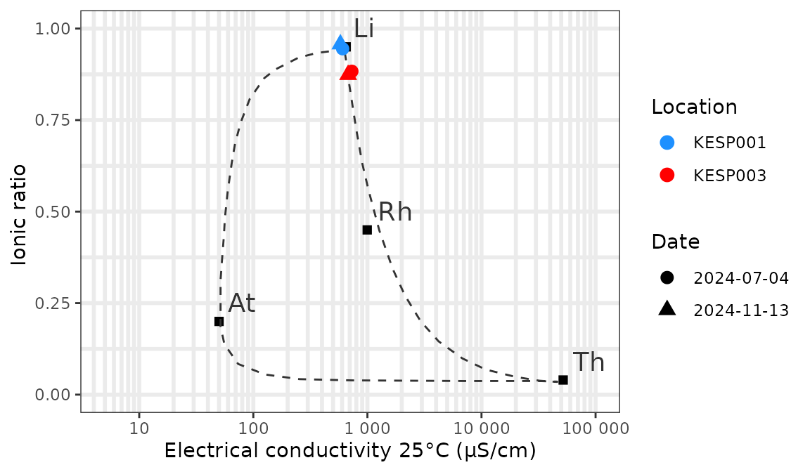

# Creating plots based on hydrochemical data

*General note: the below vignette contains frozen output of 7 Nov 2025.*
*This makes it possible to build the package with vignettes without
access to the Watina data warehouse.*

## Retrieve chemical data from Watina

We use the
[`get_chem()`](https://inbo.github.io/watina/reference/get_chem.md)
function to retrieve hydrochemical data. The example requests available
hydrochemical data since 2024 from locations in the area ‘Kesterbeek’
and saves it locally `(collect = TRUE)`:

``` r
watina <- connect_watina()
my_chem_data <-
  get_locs(watina, area_codes = "KES") %>%
  get_chem(watina, "1/1/2024", collect = TRUE)
```

``` r
my_chem_data
#> # A tibble: 272 x 10
#>    loc_code date       lab_project_id lab_sample_id chem_variable  value
#>    <chr>    <date>     <chr>          <chr>         <chr>          <dbl>
#>  1 KESP001  2024-07-04 0              42052         Al             0.050
#>  2 KESP001  2024-07-04 0              42052         Ca             109.881
#>  3 KESP001  2024-07-04 0              42052         Cl             11.349
#>  4 KESP001  2024-07-04 0              42052         CondF          599.000
#>  5 KESP001  2024-07-04 0              42052         CondL          606.700
#>  6 KESP001  2024-07-04 0              42052         Fe             2.788
#>  7 KESP001  2024-07-04 0              42052         HCO3           375.292
#>  8 KESP001  2024-07-04 0              42052         K              0.970
#>  9 KESP001  2024-07-04 0              42052         Mg             8.960
#> 10 KESP001  2024-07-04 0              42052         Mn             0.792
#> # … with 262 more rows, and 4 more variables: unit <chr>,
#> #   below_loq <lgl>, loq <dbl>, elneutr <dbl>
```

We will use this dataset to demonstrate the plotting options available
in the Watina package.

## Plot the ionic ratio against the electrical conductivity (Van Wirdum)

This diagram, devised by Geert Van Wirdum, shows the chemical similarity
of a water sample to references samples such as atmocline water
(rainwater), thalassocline water (seawater) and lithocline water
(calcium rich, fresh groundwater). The diagram plots the ionic ratio,
that is
$\left\lbrack Ca^{2 +} \right\rbrack/\left( \left\lbrack Ca^{2 +} \right\rbrack + \left\lbrack Cl^{-} \right\rbrack \right)$
(as equivalent concentrations), against the logarithm of the electrical
conductivity at 25°C.

The electrical conductivity is available for most samples in Watina, but
we need to **compute the ionic ratio**. We could do this manually for
each sample but the `watina` package also contains a
[`calculate_ir()`](https://inbo.github.io/watina/reference/calculate_ir.md)
function that can be applied directly to the output of the
[`get_chem()`](https://inbo.github.io/watina/reference/get_chem.md)
function to calculate the ionic ratio:

``` r
my_chem_data_vanwirdum <- calculate_ir(my_chem_data)
```

The obtained dataset is a wide table with the following fields (namely
all the fields from the input dataset and a new field `ir` that contains
the calculated ionic ratio):

``` r
names(my_chem_data_vanwirdum)
#>  [1] "loc_code"       "date"           "lab_project_id" "lab_sample_id" 
#>  [5] "elneutr"        "chem_variable"  "value"          "unit"          
#>  [9] "below_loq"      "loq"            "ir"
```

Now we can create the diagram of the ionic ratio against the (log of)
electrical conductivity at 25°C (the so called Van Wirdum diagram) with
the
[`ggplot_vanwirdum_background()`](https://inbo.github.io/watina/reference/ggplot_vanwirdum_background.md)
function.

This function will create the background of a Van Wirdum diagram, with
reference points for lithotrophic water (Li), atmotrophic water (At),
thalassotrophic water (Th) and optionally molunotrophic water (Rh -
polluted water as found in the Rhine).

``` r
# background with standard options:
ggplot_vanwirdum_background()
```



We can show the mixing contours of the reference points with a curve
instead of a line and plot the reference point for polluted river water
using respectively the `contour` and `rhine` arguments:

``` r
ggplot_vanwirdum_background(
  contour = "curve",
  rhine = TRUE
)
```



Now let’s add our own data for the valley of the Kesterbeek. In this
example we plot 2 locations that were sampled twice in 2024:

``` r
# get the conductivity data
my_chem_data_vanwirdum <- my_chem_data_vanwirdum %>%
  filter(chem_variable == "CondL") %>% # CondL = conductivity in the lab
  select(loc_code, date, conductivity = value, ir)

# add your own data with EC as x and IR as y and format as you wish
ggplot_vanwirdum_background(
  contour = "curve",
  lang = "en",
  rhine = TRUE
) +
  geom_point(
    data = my_chem_data_vanwirdum %>% head(n = 4),
    aes(
      x = conductivity, y = ir,
      colour = loc_code,
      shape = as.factor(date)
    ),
    size = 3
  ) +
  scale_colour_manual(name = "Location", values = c("dodgerblue", "red")) +
  scale_shape_discrete(name = "Date")
```



All the usual options of `ggplot2` are available to customize the layout
of the plot.
